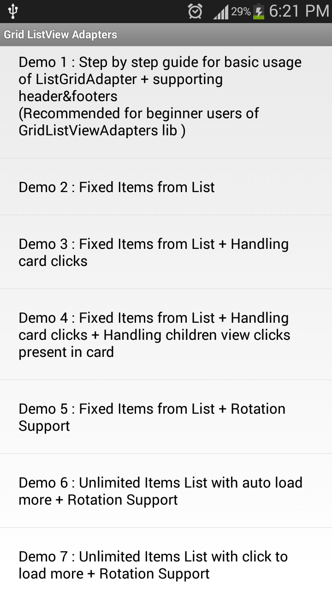
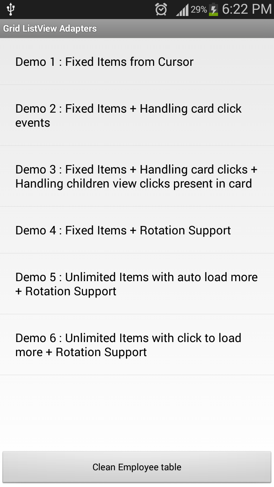
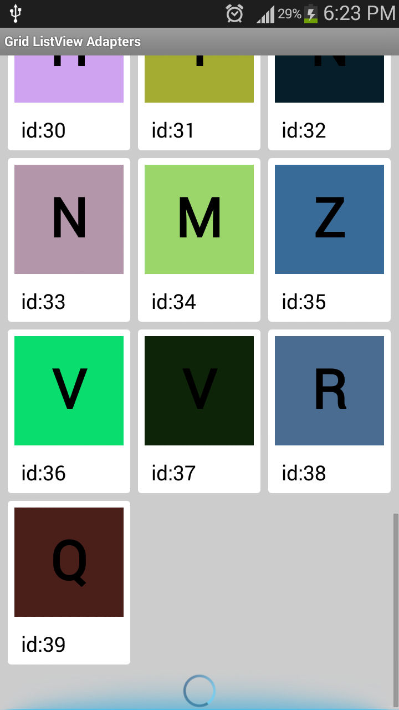
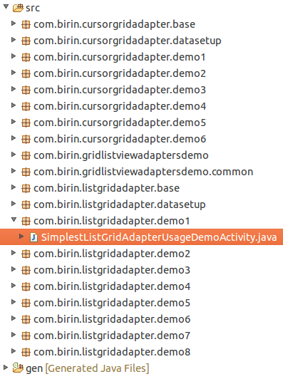

GridListViewAdapters
====================

This libarary enables you to implement GridView like card layout within ListView with added capabilites like Paginations, Addition of Header-Footer Views, also simplifies implemention for both List & Cursor data.

This library is designed on [ViewHolder] (http://developer.android.com/training/improving-layouts/smooth-scrolling.html#ViewHolder) design pattern, it provides an easier way of linking linear data to grid alligned Views. The GridListViewAdapters will do most of tedious work for you & all you have to do is create your small modular classes & link them together. 

**Looking for ListView with multiple row-types support, check [EasyListViewAdapters](https://github.com/birajpatel/EasyListViewAdapters).**

Features
========

* Enables user to add **Headers & Footers** with your Grid, as its a ListView afterall.
* Supports **flexible number of cards** in both screen orientation.
* Provides readymade PositionCalculator class which enables user to **maintain correct position after orientation** change(In case number of cards in both orienations are different).
* Library takes care of recycling all views, that **ensures performance** & helps your list view scroll smoothly.
* **Auto converts** user's linear data to grid-struture & renders it.
* **No data browsing**, Library takes care of browsing data through Grid-structure when View is being drawn or event occurs so that Users does not have to look for their data to take actions.
* Card views can be created by using **XML or Java** (doesn't restrict to XML-Only Approach).
* Load More callbacks can be registered to implement **paginatation support** to your list.
* **Handles empty cards** as well during pagination & auto replaces empty cards when more data is added.
* **Handling children viewclicks**, you can also register for Children(present inside your Cards) view click events. All these Views are registered with single OnClickListner so that this mechanism is very **memory efficient** when click event occurs users you gets clickedChildView, cardData,int eventId as callback params.

Compatibility
=========
* **Library** : API 4+(DONUT)
* **LibrarySample** : API 11+(HONEYCOMB)

Supported Data-types
====================
* **ListGridAdapter** : works with java.util.List of data.
* **CursorGridAdapter** : works with android.database.Cursor

**Note** : **CursorGridAdapter** doesn't provide any mechanism to requery attached Cursor (Like traditional CursorAdapter), This behaviour is intentionally omitted as it has been deprecated from Android Sources as well.Instead use [CursorLoader Mechanism](https://developer.android.com/training/load-data-background/setup-loader.html).

Using ListGridAdapter
=====

Check [Quick-Usage-Guide](/Extras/Documentations/ListGridAdapterQuickUsageGuide.md)

Using CursorGridAdapter
=====

Check [Quick-Usage-Guide](/Extras/Documentations/CursorGridAdapterQuickUsageGuide.md)

Sample-App screenshots
====================

<table align= 'center' border = "0">
<tr>
<td></td>
<td></td>
<td></td>
</tr>
<tr>
<td align = 'center' >ListGridAdapter</td>
<td align = 'center'>CursorGridAdapter</td>
<td align = 'center'>Demo Screen</td>
</tr>
</table>

How to understand Sample-App
====================

* **1** For basic step by step explaination read [SimplestListGridAdapterUsageDemoActivity.java](/GridListViewAdaptersDemo/src/com/birin/listgridadapter/demo1/SimplestListGridAdapterUsageDemoActivity.java)
* **2** Read other ListGridAdapter's Demo.
* **3** Read other CursorGridAdapter's Demo.

Progaurd
========
No need to add any extra config.

Debugging 
=========

See the **[Debugging Exceptions](/Extras/Documentations/debugging_exceptions.md)** to know about all Exceptions thrown by library & how to fix them.

License
=======
   Copyright 2014-present Biraj Patel

   Licensed under the Apache License, Version 2.0 (the "License");
   you may not use this file except in compliance with the License.
   You may obtain a copy of the License at

       http://www.apache.org/licenses/LICENSE-2.0

   Unless required by applicable law or agreed to in writing, software
   distributed under the License is distributed on an "AS IS" BASIS,
   WITHOUT WARRANTIES OR CONDITIONS OF ANY KIND, either express or implied.
   See the License for the specific language governing permissions and
   limitations under the License.

